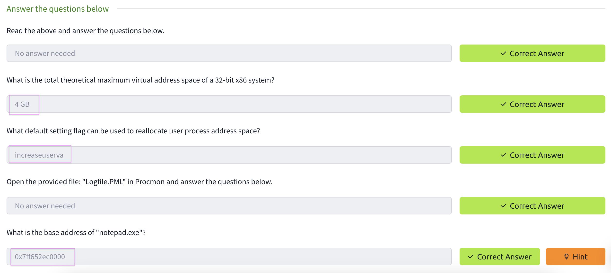

# Windows-Internals

I completed the Windows Internals course on TryHackMe, where I learned about Windows processes, threads, virtual memory, dynamic link libraries, and the Portable Executable format. To complete the tasks, I utilized tools such as ProcMon and Detect It Easy (DIE). This course provided me with a solid understanding of the internals of the Windows operating system and enhanced my skills in analyzing and troubleshooting Windows applications.

## Task2-2

## Task2-3

## Task2-4

## Task2 Correct Answer

## Task3-2

## Task3-3

## Task3 Correct Answer

## Task4-2

## Task4-3

## Task4-5

## Task4 Correct Answer

## Task5-2

## Task5-3

## Task5-4

## Task5 Correct Answer

## Task6-2

## Task6-3

## Task6-4

## Task6-5

## Task6-6

## Task6 Correct Answer

## Task7-2

## Task7 Correct Answwer

## All Task Completed

